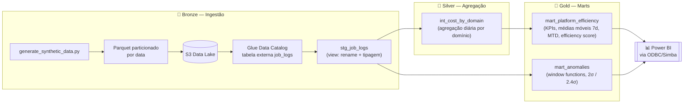
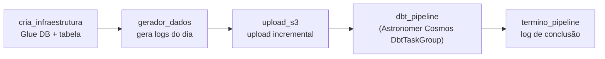
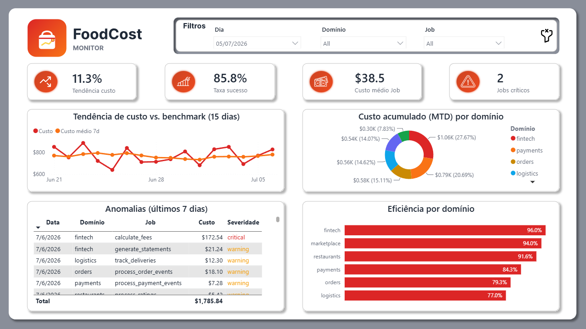
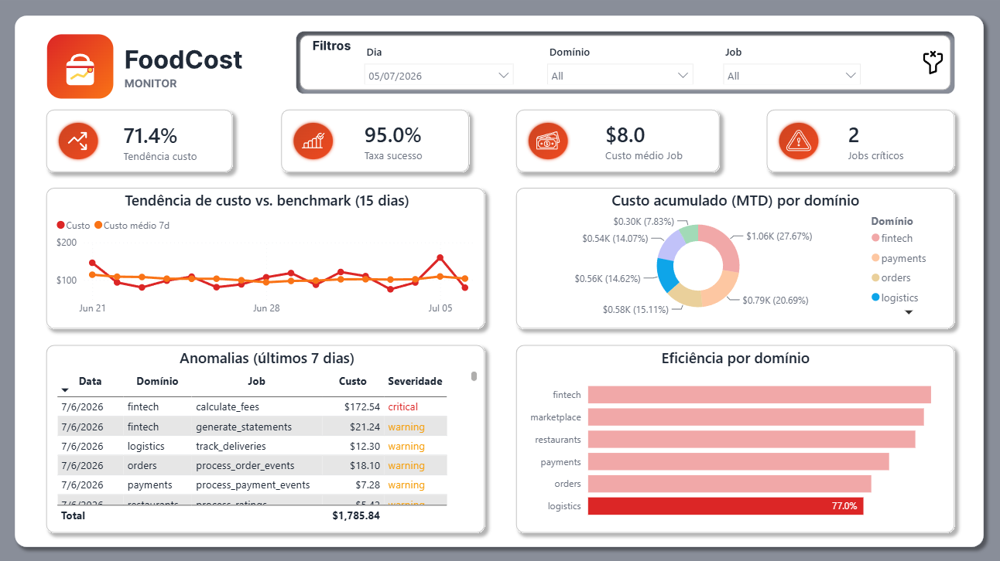

# 🍔 Food Delivery Cost Monitor

**Pipeline de dados end-to-end para monitoramento de custos de plataforma, com detecção automática de anomalias.**

Projeto de portfólio inspirado no dia a dia de um time de **Governança de Dados / FinOps** em uma plataforma de delivery de larga escala (contexto de referência: iFood).

<p align="left">
  
  
  
  
  
  
  
</p>

<p align="left">
  <a href="https://app.powerbi.com/view?r=eyJrIjoiMWU2N2VkZDktOTg3MC00NTA2LTljYTgtYjUyNWU3OTNiMzZiIiwidCI6IjJiZDE5YWQ4LTcyZTUtNGY2ZC1hZmY1LWRhOTMwMTdmZGYxYiJ9">
    
  </a>
</p>

---

## 📑 Sumário

- [Contexto de negócio](#-contexto-de-negócio)
- [O que este projeto entrega](#-o-que-este-projeto-entrega)
- [Arquitetura](#-arquitetura)
- [Stack técnica](#-stack-técnica)
- [Estrutura de pastas](#-estrutura-de-pastas)
- [Modelo de dados](#-modelo-de-dados)
- [Detecção de anomalias](#-detecção-de-anomalias)
- [Dashboard](#-dashboard)
- [Como rodar o projeto](#-como-rodar-o-projeto)
- [Comandos úteis](#-comandos-úteis)
- [Qualidade de código](#-qualidade-de-código)
- [Status do projeto](#-status-do-projeto--roadmap)
- [Referências](#-referências)

---

## 💡 Contexto de negócio

Uma plataforma de delivery em larga escala processa **centenas de milhões de pedidos por mês**, distribuídos em múltiplos domínios de dados — pedidos, pagamentos, fintech, marketplace, logística e restaurantes. Cada domínio executa dezenas de jobs de processamento de dados (Spark/Databricks) todos os dias, e o custo de nuvem associado a esse processamento pode variar drasticamente sem visibilidade adequada.

Sem um monitoramento centralizado, os times de engenharia não sabem responder perguntas como:

- 💸 Quais domínios estão consumindo mais recursos e custo?
- 📈 Quais jobs tiveram um crescimento anômalo de custo?
- 🗓️ Qual é a tendência de custo ao longo do tempo, por domínio?
- 🎯 Onde estão as maiores oportunidades de otimização (FinOps)?

Este projeto simula exatamente esse cenário: um pipeline que **ingere, transforma, analisa e visualiza** dados de custo e uso de recursos de dados, no mesmo espírito de uma solução real de FinOps / Eficiência de Plataforma.

## 🎯 O que este projeto entrega

1. **Geração** de logs sintéticos de execução de jobs, com sazonalidade (picos no almoço/jantar) e outliers propositais de custo
2. **Ingestão** dos dados brutos em um Data Lake na AWS (S3, formato Parquet particionado por data)
3. **Transformação e modelagem** dos dados com **dbt**, usando **AWS Athena** como engine de query, seguindo o padrão medalhão (Bronze → Silver → Gold)
4. **Detecção de anomalias de custo** direto em SQL, via window functions (desvio padrão sobre janela móvel de 7 dias)
5. **Orquestração** de ponta a ponta com **Apache Airflow**, integrando o grafo de dependências do dbt via **Astronomer Cosmos**
6. **Visualização** das métricas em um dashboard **Power BI** publicado e interativo — [ver ao vivo](https://app.powerbi.com/view?r=eyJrIjoiMWU2N2VkZDktOTg3MC00NTA2LTljYTgtYjUyNWU3OTNiMzZiIiwidCI6IjJiZDE5YWQ4LTcyZTUtNGY2ZC1hZmY1LWRhOTMwMTdmZGYxYiJ9)

## 🏗️ Arquitetura

Pipeline construído no padrão **medalhão (Bronze → Silver → Gold)**:



Cada camada é materializada em um schema Athena próprio — `cost_monitor_bronze`, `cost_monitor_silver` e `cost_monitor_gold`. Note que `mart_anomalies` lê direto de `stg_job_logs`, e não do `int_cost_by_domain`: a detecção de anomalias precisa da granularidade de **job individual**, que a agregação por domínio já teria perdido.

**Orquestração diária** — DAG `food_delivery_cost_monitor` no Airflow (ambiente local gerenciado pelo **Astro CLI**):



O **Astronomer Cosmos** converte o grafo de dependências do projeto dbt (`stg_job_logs → int_cost_by_domain → mart_platform_efficiency / mart_anomalies` + testes) em um `TaskGroup` nativo do Airflow — uma task por model/teste, em vez de uma task monolítica por camada. O dbt roda em uma **virtualenv dedicada**, instalada em build time no `Dockerfile`, para não conflitar com as dependências fixadas pelo Astro Runtime.

## 🧰 Stack técnica

| Camada | Tecnologia | Papel no projeto |
|---|---|---|
| Linguagem | Python 3.12 | Geração de dados, ingestão, infraestrutura |
| Orquestração | Apache Airflow 2.8+ (via Astro CLI) | DAG diária, retries, agendamento |
| Integração dbt ↔ Airflow | Astronomer Cosmos | Converte o DAG do dbt em tasks nativas do Airflow |
| Transformação | dbt (dbt-core + dbt-athena) | Modelagem em camadas (staging/intermediate/marts) |
| Engine de query | AWS Athena | Executa o SQL do dbt sobre os arquivos no S3 |
| Data Lake | AWS S3 | Armazenamento dos Parquets particionados |
| Catálogo de dados | AWS Glue Data Catalog | Registro de schema e partições da tabela externa |
| Dashboard | Power BI Desktop + Service | KPIs, tendências e anomalias, via ODBC (driver Simba); publicado via *Publish to web* |
| Empacotamento | Docker (imagem customizada do Astro Runtime) | Runtime do Airflow + venv isolada para o dbt |
| Dependências | Poetry + taskipy | Gestão de pacotes e task runner do projeto Python |
| Qualidade | black, isort, bandit, sqlfluff, pre-commit | Formatação, segurança e lint de SQL |

## 📂 Estrutura de pastas

O código do pipeline e o projeto dbt vivem dentro de `airflow_project/`, para que o **build context do Astro CLI** copie tudo diretamente no `Dockerfile`, sem precisar de uma pasta `include/` de sincronização.

```
food-delivery-cost-monitor/
├── airflow_project/                    # projeto Astro CLI (astro dev init)
│   ├── dags/
│   │   └── pipeline_daily.py           # DAG diária — orquestra o pipeline completo
│   ├── pipeline/                       # módulos Python reutilizáveis pelas DAGs
│   │   ├── ingestion/
│   │   │   ├── generate_synthetic_data.py   # gera logs sintéticos (sazonalidade + outliers)
│   │   │   └── upload_to_s3.py              # upload incremental para o S3
│   │   ├── infra/
│   │   │   ├── athena_setup.py         # cria database/tabela externa no Glue + partições
│   │   │   └── logi.py                 # logger compartilhado
│   │   └── pipeline_config.py          # variáveis de ambiente e clientes AWS (boto3)
│   ├── dbt_food_cost_monitor/          # projeto dbt
│   │   ├── models/
│   │   │   ├── staging/                # stg_job_logs (+ _schema.yml, _sources.yml)
│   │   │   ├── intermediate/           # int_cost_by_domain — agregação diária
│   │   │   └── marts/                  # mart_platform_efficiency, mart_anomalies
│   │   ├── dbt_project.yml             # materializações e schema por camada
│   │   └── profiles.yml                # credenciais Athena via env_var()
│   ├── tests/                          # testes de integridade das DAGs
│   ├── Dockerfile                      # imagem customizada do Airflow (venv dbt dedicada)
│   ├── requirements.txt                # dependências Python do Airflow (astronomer-cosmos)
│   └── .env                            # variáveis de ambiente (gitignorado — ver passo 2)
├── dashboard/                          # projeto Power BI
│   ├── food-delivery-cost-dashboard.pbip
│   ├── *.Report/                       # definição dos visuais
│   ├── *.SemanticModel/                # tabelas, medidas DAX e relacionamentos (TMDL)
│   └── assets/                         # prints do dashboard, logos e paleta de cores
├── docs/
│   ├── food-delivery-cost-monitor-PRD.md   # documento de requisitos do produto (PRD)
│   └── dashboard.md                    # modelo semântico, medidas DAX e visuais
├── .env.example                        # template de variáveis de ambiente
├── pyproject.toml                      # dependências e tasks do projeto Python (Poetry)
└── CLAUDE.md                           # guia de contexto do repositório para uso com IA
```

## 🗃️ Modelo de dados

### Camada raw — `job_logs`

Logs sintéticos de execução de jobs Spark/Databricks, gerados para **6 domínios de negócio**, com sazonalidade diária (picos no almoço e no jantar) e **5% de outliers de custo** injetados de propósito para alimentar o detector de anomalias.

| Campo | Tipo | Descrição |
|---|---|---|
| `job_id` | STRING | Identificador único do job (UUID) |
| `execution_date` | DATE | Data de execução |
| `domain` | STRING | `orders`, `payments`, `fintech`, `marketplace`, `logistics`, `restaurants` |
| `job_name` | STRING | Nome do job de processamento |
| `duration_min` | FLOAT | Duração da execução em minutos |
| `dbu_consumed` | FLOAT | Databricks Units consumidas (simulado) |
| `estimated_cost_usd` | FLOAT | Custo estimado em USD |
| `status` | STRING | `success`, `failed`, `timeout` |
| `cluster_type` | STRING | `job_cluster`, `all_purpose` |
| `created_at` | TIMESTAMP | Timestamp de criação do registro |

### Convenção de nomenclatura das colunas

A tabela raw preserva os nomes originais em inglês (é a fonte, não deve ser reescrita). **A partir da staging, todas as colunas são renomeadas para português com um prefixo que indica o tipo do dado** — convenção comum em modelagem corporativa brasileira, que deixa o tipo explícito na leitura do SQL sem precisar consultar o schema:

| Prefixo | Tipo | Exemplo |
|---|---|---|
| `id_` | Identificador | `id_job` |
| `dt_` | Data / timestamp | `dt_execucao`, `dt_criacao` |
| `nm_` | Nome / texto categórico | `nm_dominio`, `nm_job`, `nm_severidade` |
| `vl_` | Valor monetário | `vl_estimativa_custo_usd`, `vl_total_custo_usd` |
| `nr_` | Número (contagem, duração, score) | `nr_total_jobs`, `nr_duracao_minutos`, `nr_sigma_desvio` |
| `st_` | Status | `st_status` |
| `tp_` | Tipo | `tp_cluster` |

A mesma convenção é reaproveitada nas medidas DAX do Power BI (`Vl.`, `Nr.`, `Pc.`, `Ds.`) — ver [`docs/dashboard.md`](docs/dashboard.md#convenção-de-nomes-das-medidas).

### Camadas do dbt

Cada camada é materializada em um **schema Athena próprio**, configurado em `dbt_project.yml`:

| Model | Camada | Schema / materialização | O que faz |
|---|---|---|---|
| `stg_job_logs` | Staging | `cost_monitor_bronze` · view | Renomeia e tipa explicitamente todas as colunas (`CAST` + macros `dbt.type_*`), filtra `vl_estimativa_custo_usd > 0` e deriva `nr_semana`. Só transformações linha a linha. Tem **contrato dbt** (`contract: enforced`) — o build falha se um tipo divergir do declarado. |
| `int_cost_by_domain` | Intermediate | `cost_monitor_silver` · table | Agregação diária por `(dt_execucao, nm_dominio)`: total de jobs, jobs com sucesso, custo total/médio/máximo, duração total/média e `nr_taxa_sucesso`. |
| `mart_platform_efficiency` | Marts | `cost_monitor_gold` · table | KPIs finais: média e desvio padrão móvel de 7 dias, custo acumulado do mês (MTD), custo do dia anterior via `LAG()`, variação percentual e `nr_eficiencia_score` (0–100). |
| `mart_anomalies` | Marts | `cost_monitor_gold` · table | Detecção de anomalias por `(nm_dominio, nm_job)` via window functions, comparando o custo observado ao limite de 2σ. Retorna **apenas** as linhas anômalas. |

## 🚨 Detecção de anomalias

A lógica de detecção é implementada **inteiramente em SQL**, dentro do model `mart_anomalies.sql` — sem nenhum script Python adicional. Isso mantém toda a regra de negócio em uma camada declarativa, testável e fácil de explicar:

1. Para cada par `(nm_dominio, nm_job)`, calcula a **média móvel** e o **desvio padrão** de custo dos últimos 7 dias, usando `AVG`/`STDDEV_POP` com `ROWS BETWEEN 6 PRECEDING AND CURRENT ROW`.
2. Calcula o limite superior (`vl_limite_superior = média_7d + 2 * desvio_7d`) e quantos sigmas o custo observado está acima da média (`nr_sigma_desvio`), protegendo a divisão com `NULLIF(desvio_7d, 0)` para jobs de custo constante.
3. Mantém no resultado **apenas** as execuções onde `vl_estimativa_custo_usd > vl_limite_superior` — o model é uma tabela de alertas, não um espelho da staging.
4. Classifica a severidade:
   - `warning` → entre 2σ e 2.4σ acima da média
   - `critical` → acima de 2.4σ

Para validar o detector, o script de geração de dados injeta **5% de outliers** (multiplicador aleatório de 3x a 8x no custo), distribuídos de forma não uniforme entre os domínios — `fintech` e `payments` recebem mais outliers, simulando áreas historicamente mais voláteis em custo.

## 📊 Dashboard

Camada final do pipeline: um relatório Power BI que consome **apenas a camada Gold** (`cost_monitor_gold`) via ODBC/Athena.

<p align="left">
  <a href="https://app.powerbi.com/view?r=eyJrIjoiMWU2N2VkZDktOTg3MC00NTA2LTljYTgtYjUyNWU3OTNiMzZiIiwidCI6IjJiZDE5YWQ4LTcyZTUtNGY2ZC1hZmY1LWRhOTMwMTdmZGYxYiJ9">
    <strong>🔗 Abrir o dashboard interativo ao vivo</strong>
  </a>
</p>

> Publicado via *Publish to web*. Todos os dados são **sintéticos**, gerados pelo próprio pipeline — nenhum dado real de qualquer empresa.



**KPIs no topo** — tendência de custo vs. dia anterior, taxa de sucesso dos jobs, custo médio por job e contagem de jobs em estado `critical`.

**Visuais** — tendência de custo vs. benchmark móvel de 7 dias (15 dias), custo acumulado do mês (MTD) por domínio, tabela de anomalias dos últimos 7 dias com badge de severidade, e score de eficiência por domínio.

### Interatividade

Os slicers de **dia**, **domínio** e **job** recalculam todo o relatório. Abaixo, o mesmo dashboard filtrado no domínio `logistics` — a tendência de custo salta de 11.3% para 71.4%, o custo médio por job cai de $38.5 para $8.0, e o gráfico de eficiência destaca o domínio selecionado mantendo os demais como referência:



📖 **Documentação completa da camada de visualização** — modelo semântico, `dim_calendario`, as ~33 medidas DAX, decisão de Import vs. DirectQuery e limitações conhecidas: [`docs/dashboard.md`](docs/dashboard.md)

## 🚀 Como rodar o projeto

> Guia pensado para quem nunca rodou o projeto antes. Cada passo é independente — se algo falhar, você pode repetir só aquele passo.

### Pré-requisitos

| Ferramenta | Para quê | Link |
|---|---|---|
| Python 3.12+ | Rodar os scripts do pipeline | [python.org](https://www.python.org/downloads/) |
| [Poetry](https://python-poetry.org/docs/#installation) | Gerenciar dependências Python | `pipx install poetry` |
| [Docker Desktop](https://www.docker.com/products/docker-desktop/) | Rodar o Airflow localmente | necessário para o Astro CLI |
| [Astro CLI](https://www.astronomer.io/docs/astro/cli/install-cli) | Subir o ambiente Airflow | `winget install -e --id Astronomer.Astro` |
| Conta AWS (Free Tier) | S3, Athena e Glue | necessário apenas para rodar o pipeline de ponta a ponta |
| Power BI Desktop | Visualizar o dashboard | opcional, só para a camada de visualização |

### 1. Clonar o repositório e instalar dependências

```bash
git clone <url-do-repositorio>
cd food-delivery-cost-monitor

poetry install --with dev
poetry run pre-commit install
```

### 2. Configurar variáveis de ambiente

Copie o template para **dentro de `airflow_project/`** e preencha com suas credenciais AWS:

```bash
cp .env.example airflow_project/.env
```

> 📍 **Por que dentro de `airflow_project/`?** O Astro CLI carrega automaticamente o `.env` que estiver na raiz do projeto Astro, injetando as variáveis nos containers do Airflow. E como `pipeline_config.py` usa `load_dotenv()` — que procura o arquivo subindo a partir do diretório atual — o mesmo `.env` serve tanto para a execução dentro do Airflow quanto para rodar os scripts na mão de `airflow_project/pipeline/`. Um único arquivo, dois modos de execução.

```dotenv
AWS_ACCESS_KEY_ID=<sua-access-key>
AWS_SECRET_ACCESS_KEY=<sua-secret-key>
AWS_REGION=us-east-1
S3_BUCKET=<nome-do-seu-bucket>
ATHENA_DATABASE=cost_monitor

# Usadas pelo profiles.yml do dbt
DBT_DATABASE=awsdatacatalog
DBT_REGION_NAME=us-east-1
DBT_S3_DATA_DIR=<s3://seu-bucket/...>
DBT_STAGING_DIR=<s3://seu-bucket/athena-results/>
DBT_SCHEMA=cost_monitor
DBT_THREADS=4
DBT_TYPE=athena
```

Todas as variáveis acima são obrigatórias. `S3_BUCKET` é lida por `pipeline_config.py` sem valor default — se faltar, o import do módulo levanta `ValueError`. As variáveis `DBT_*` são consumidas pelo `profiles.yml` via `env_var()`, então a ausência de qualquer uma delas faz o `dbt run` falhar no parse.

> ℹ️ `ATHENA_OUTPUT_LOCATION` **não** é variável de ambiente: ela é derivada em código como `s3://{S3_BUCKET}/athena-results/` em `pipeline_config.py`.

> ⚠️ `.env` nunca é commitado (coberto pelo `.gitignore` da raiz e pelo de `airflow_project/`) — a permissão IAM mínima necessária é `s3:{PutObject,GetObject,ListBucket}`, `athena:{StartQueryExecution,GetQueryResults}`, `glue:{CreateTable,GetTable,UpdateTable}`.

### 3. Testar a geração de dados localmente (sem AWS)

Antes de subir o Airflow, é possível gerar e inspecionar os dados sintéticos direto no seu ambiente Python:

```bash
cd airflow_project/pipeline
python -m ingestion.generate_synthetic_data --days 30
```

Isso cria arquivos Parquet particionados por data em `pipeline/data/raw/date=YYYY-MM-DD/`.

### 4. Subir o ambiente Airflow local

```bash
cd airflow_project
astro dev start
```

Isso builda a imagem customizada (`Dockerfile`) — com a venv dedicada do dbt — e sobe os containers do Airflow (webserver, scheduler, Postgres, triggerer). A UI fica disponível em **http://localhost:8080** (usuário/senha padrão: `admin`/`admin`).

Dispare a DAG `food_delivery_cost_monitor` manualmente pela UI para rodar o pipeline completo: geração de dados → upload S3 → transformação dbt → notificação de conclusão.

```bash
astro dev ps       # ver status dos containers
astro dev logs      # acompanhar logs
astro dev stop       # parar o ambiente
```

### 5. Rodar o dbt manualmente (opcional, fora do Airflow)

Útil para iterar rápido nos models sem esperar o Airflow:

```bash
cd airflow_project/dbt_food_cost_monitor
dbt run
dbt test
```

### 6. Conectar o Power BI

Crie um **DSN de sistema** chamado exatamente `Amazon Athena ODBC` (driver **Simba**), configurando nele a região AWS, o catálogo `AwsDataCatalog` e o *S3 staging directory* — o mesmo valor de `DBT_STAGING_DIR` no `.env`. Depois abra `dashboard/food-delivery-cost-dashboard.pbip` no Power BI Desktop e clique em **Atualizar**.

O modelo importa duas tabelas do schema `cost_monitor_gold`: `mart_platform_efficiency` e `mart_anomalies`. O nome do DSN está gravado na query M, então um DSN com outro nome exige editar a fonte no Power Query.

Detalhes do modelo semântico e das medidas em [`docs/dashboard.md`](docs/dashboard.md).

## 🛠️ Comandos úteis

Os comandos do Poetry/taskipy abaixo atuam sobre `airflow_project/pipeline/`:

```bash
poetry run task lint         # formata o código (black + isort)
poetry run task lint-check   # verifica formatação sem alterar (usado em CI)
poetry run task security     # scan de segurança com bandit
poetry run task athena_setup # cria o database e a tabela no Glue/Athena
```

Lint de SQL (sqlfluff, dialeto ANSI, sobre o projeto dbt):

```bash
poetry run sqlfluff lint airflow_project/dbt_food_cost_monitor/ --dialect ansi
poetry run sqlfluff fix airflow_project/dbt_food_cost_monitor/ --dialect ansi
```

## ✅ Qualidade de código

- **black + isort** — formatação padronizada de Python
- **bandit** — scan estático de segurança
- **sqlfluff** — lint de SQL para os models dbt
- **ruff** — lint/format adicional via pre-commit
- **pre-commit hooks** — todos os checks acima rodam automaticamente antes de cada commit
- **Testes dbt** (`not_null`, `unique`, `accepted_values`, `dbt_utils.expression_is_true`, `dbt_utils.accepted_range`) garantem qualidade de dados em cada camada — ver os arquivos `_schema.yml` dentro de `models/`

## 📌 Status do projeto & roadmap

Este é um projeto de portfólio em desenvolvimento ativo. Estado atual:

O pipeline está **completo e funcional de ponta a ponta**, da geração dos dados ao dashboard publicado. O que resta são melhorias de engenharia em volta dele (CI, testes, IaC), não lacunas no fluxo principal.

**✅ Implementado**
- Geração de dados sintéticos com sazonalidade e outliers propositais
- Upload incremental para S3, particionado por data
- Criação automática de infraestrutura no Glue/Athena (database, tabela externa, partições)
- 4 models dbt completos (`stg_job_logs`, `int_cost_by_domain`, `mart_platform_efficiency`, `mart_anomalies`), com contrato na staging e testes de qualidade em todas as camadas
- DAG diária no Airflow orquestrando o pipeline completo, com integração dbt via Astronomer Cosmos
- **Dashboard Power BI publicado** — modelo em estrela com `dim_calendario`, ~33 medidas DAX, 4 KPI cards e 4 visuais, com [link público ao vivo](https://app.powerbi.com/view?r=eyJrIjoiMWU2N2VkZDktOTg3MC00NTA2LTljYTgtYjUyNWU3OTNiMzZiIiwidCI6IjJiZDE5YWQ4LTcyZTUtNGY2ZC1hZmY1LWRhOTMwMTdmZGYxYiJ9)
- Pipeline de qualidade de código local (lint, bandit, sqlfluff, pre-commit)

**🔜 Próximos passos**
- Testes automatizados (pytest) para os módulos Python de ingestão — hoje `airflow_project/tests/` só valida a integridade das DAGs
- Pipeline de CI (GitHub Actions) rodando lint/testes a cada push
- Alertas automáticos (Slack/e-mail) para anomalias `critical`
- Infraestrutura como código (Terraform) para os recursos AWS
- Refresh agendado do dashboard via gateway de dados apontando para o Athena
- Renderizar a banda de confiança ±2σ no gráfico de tendência (medidas já existem no modelo — ver [`docs/dashboard.md`](docs/dashboard.md#limitações-conhecidas))

---

<p align="center">
  Projeto de portfólio desenvolvido por <strong>Rodrigo Silva</strong> — feedback e sugestões são bem-vindos.
</p>

<p align="center">
  <a href="https://www.linkedin.com/in/rodrigosilva-dataengineer/">
    
  </a>
  <a href="https://app.powerbi.com/view?r=eyJrIjoiMWU2N2VkZDktOTg3MC00NTA2LTljYTgtYjUyNWU3OTNiMzZiIiwidCI6IjJiZDE5YWQ4LTcyZTUtNGY2ZC1hZmY1LWRhOTMwMTdmZGYxYiJ9">
    
  </a>
</p>
