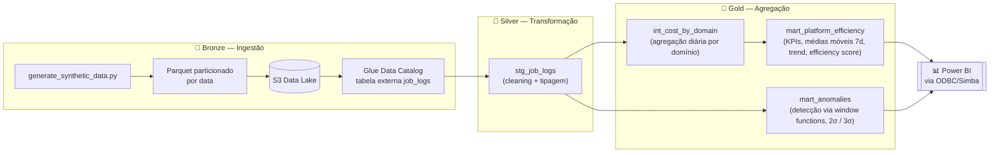
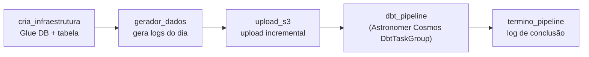

# 🍔 Food Delivery Cost Monitor

**Pipeline de dados end-to-end para monitoramento de custos de plataforma, com detecção automática de anomalias.**

Projeto de portfólio inspirado no dia a dia de um time de **Governança de Dados / FinOps** em uma plataforma de delivery de larga escala (contexto de referência: iFood).

<p align="left">
  
  
  
  
  
  
  
</p>

---

## 📑 Sumário

- [Contexto de negócio](#-contexto-de-negócio)
- [O que este projeto entrega](#-o-que-este-projeto-entrega)
- [Arquitetura](#-arquitetura)
- [Stack técnica](#-stack-técnica)
- [Estrutura de pastas](#-estrutura-de-pastas)
- [Modelo de dados](#-modelo-de-dados)
- [Detecção de anomalias](#-detecção-de-anomalias)
- [Como rodar o projeto](#-como-rodar-o-projeto)
- [Comandos úteis](#-comandos-úteis)
- [Qualidade de código](#-qualidade-de-código)
- [Status do projeto](#-status-do-projeto--roadmap)
- [Referências](#-referências)

---

## 💡 Contexto de negócio

Uma plataforma de delivery em larga escala processa **centenas de milhões de pedidos por mês**, distribuídos em múltiplos domínios de dados — pedidos, pagamentos, fintech, marketplace, logística e restaurantes. Cada domínio executa dezenas de jobs de processamento de dados (Spark/Databricks) todos os dias, e o custo de nuvem associado a esse processamento pode variar drasticamente sem visibilidade adequada.

Sem um monitoramento centralizado, os times de engenharia não sabem responder perguntas como:

- 💸 Quais domínios estão consumindo mais recursos e custo?
- 📈 Quais jobs tiveram um crescimento anômalo de custo?
- 🗓️ Qual é a tendência de custo ao longo do tempo, por domínio?
- 🎯 Onde estão as maiores oportunidades de otimização (FinOps)?

Este projeto simula exatamente esse cenário: um pipeline que **ingere, transforma, analisa e visualiza** dados de custo e uso de recursos de dados, no mesmo espírito de uma solução real de FinOps / Eficiência de Plataforma.

## 🎯 O que este projeto entrega

1. **Geração** de logs sintéticos de execução de jobs, com sazonalidade (picos no almoço/jantar) e outliers propositais de custo
2. **Ingestão** dos dados brutos em um Data Lake na AWS (S3, formato Parquet particionado por data)
3. **Transformação e modelagem** dos dados com **dbt**, usando **AWS Athena** como engine de query, seguindo o padrão medalhão (Bronze → Silver → Gold)
4. **Detecção de anomalias de custo** direto em SQL, via window functions (desvio padrão sobre janela móvel de 7 dias)
5. **Orquestração** de ponta a ponta com **Apache Airflow**, integrando o grafo de dependências do dbt via **Astronomer Cosmos**
6. **Visualização** das métricas em um dashboard **Power BI**

## 🏗️ Arquitetura

Pipeline construído no padrão **medalhão (Bronze → Silver → Gold)**:



**Orquestração diária** — DAG `food_delivery_cost_monitor` no Airflow (ambiente local gerenciado pelo **Astro CLI**):



O **Astronomer Cosmos** converte o grafo de dependências do projeto dbt (`stg_job_logs → int_cost_by_domain → mart_platform_efficiency / mart_anomalies` + testes) em um `TaskGroup` nativo do Airflow — uma task por model/teste, em vez de uma task monolítica por camada. O dbt roda em uma **virtualenv dedicada**, instalada em build time no `Dockerfile`, para não conflitar com as dependências fixadas pelo Astro Runtime.

## 🧰 Stack técnica

| Camada | Tecnologia | Papel no projeto |
|---|---|---|
| Linguagem | Python 3.12 | Geração de dados, ingestão, infraestrutura |
| Orquestração | Apache Airflow 2.8+ (via Astro CLI) | DAG diária, retries, agendamento |
| Integração dbt ↔ Airflow | Astronomer Cosmos | Converte o DAG do dbt em tasks nativas do Airflow |
| Transformação | dbt (dbt-core + dbt-athena) | Modelagem em camadas (staging/intermediate/marts) |
| Engine de query | AWS Athena | Executa o SQL do dbt sobre os arquivos no S3 |
| Data Lake | AWS S3 | Armazenamento dos Parquets particionados |
| Catálogo de dados | AWS Glue Data Catalog | Registro de schema e partições da tabela externa |
| Dashboard | Power BI Desktop | KPIs, tendências e anomalias, via ODBC (driver Simba) |
| Empacotamento | Docker (imagem customizada do Astro Runtime) | Runtime do Airflow + venv isolada para o dbt |
| Dependências | Poetry + taskipy | Gestão de pacotes e task runner do projeto Python |
| Qualidade | black, isort, bandit, sqlfluff, pre-commit | Formatação, segurança e lint de SQL |

## 📂 Estrutura de pastas

O código do pipeline e o projeto dbt vivem dentro de `airflow_project/`, para que o **build context do Astro CLI** copie tudo diretamente no `Dockerfile`, sem precisar de uma pasta `include/` de sincronização.

```
food-delivery-cost-monitor/
├── airflow_project/                    # projeto Astro CLI (astro dev init)
│   ├── dags/
│   │   └── pipeline_daily.py           # DAG diária — orquestra o pipeline completo
│   ├── pipeline/                       # módulos Python reutilizáveis pelas DAGs
│   │   ├── ingestion/
│   │   │   ├── generate_synthetic_data.py   # gera logs sintéticos (sazonalidade + outliers)
│   │   │   └── upload_to_s3.py              # upload incremental para o S3
│   │   ├── infra/
│   │   │   ├── athena_setup.py         # cria database/tabela externa no Glue + partições
│   │   │   └── logi.py                 # logger compartilhado
│   │   └── pipeline_config.py          # variáveis de ambiente e clientes AWS (boto3)
│   ├── dbt_food_cost_monitor/          # projeto dbt
│   │   └── models/
│   │       ├── staging/                # stg_job_logs — limpeza e tipagem
│   │       ├── intermediate/           # int_cost_by_domain — agregação diária
│   │       └── marts/                  # mart_platform_efficiency, mart_anomalies
│   ├── tests/                          # testes de integridade das DAGs
│   ├── Dockerfile                      # imagem customizada do Airflow (venv dbt dedicada)
│   └── requirements.txt                # dependências Python do Airflow (astronomer-cosmos)
├── dashboard/                          # projeto Power BI (.pbip) — KPIs e visualizações
├── docs/
│   └── food-delivery-cost-monitor-PRD.md   # documento de requisitos do produto (PRD)
├── .env.example                        # template de variáveis de ambiente
├── pyproject.toml                      # dependências e tasks do projeto Python (Poetry)
└── CLAUDE.md                           # guia de contexto do repositório para uso com IA
```

## 🗃️ Modelo de dados

### Camada raw — `job_logs`

Logs sintéticos de execução de jobs Spark/Databricks, gerados para **6 domínios de negócio**, com sazonalidade diária (picos no almoço e no jantar) e **5% de outliers de custo** injetados de propósito para alimentar o detector de anomalias.

| Campo | Tipo | Descrição |
|---|---|---|
| `job_id` | STRING | Identificador único do job (UUID) |
| `execution_date` | DATE | Data de execução |
| `domain` | STRING | `orders`, `payments`, `fintech`, `marketplace`, `logistics`, `restaurants` |
| `job_name` | STRING | Nome do job de processamento |
| `duration_min` | FLOAT | Duração da execução em minutos |
| `dbu_consumed` | FLOAT | Databricks Units consumidas (simulado) |
| `estimated_cost_usd` | FLOAT | Custo estimado em USD |
| `status` | STRING | `success`, `failed`, `timeout` |
| `cluster_type` | STRING | `job_cluster`, `all_purpose` |
| `created_at` | TIMESTAMP | Timestamp de criação do registro |

### Camadas do dbt

| Model | Camada | O que faz |
|---|---|---|
| `stg_job_logs` | Staging (Bronze/Silver) | Tipagem explícita, remoção de registros com status inválido ou custo negativo. Só transformações linha a linha — sem agregações ou window functions. |
| `int_cost_by_domain` | Intermediate | Agregação diária por domínio: total de jobs, taxa de sucesso, custo total/médio/máximo, duração total/média. |
| `mart_platform_efficiency` | Marts (Gold) | KPIs finais: média e desvio padrão móvel de 7 dias, custo acumulado do mês (MTD), variação percentual vs. dia anterior e `efficiency_score` (0–100). |
| `mart_anomalies` | Marts (Gold) | Detecção de anomalias por `(domínio, job)` via window functions, comparando o custo observado ao limite de 2σ. |

> **Decisão de design:** `stg_job_logs` só recebe transformações que operam sobre uma única linha por vez. Qualquer coluna que dependa de agregação ou ranking entre registros (ex.: classificação por quartil de custo, flag de candidato a anomalia) é calculada apenas nas camadas `intermediate`/`marts`, depois que as estatísticas do período já foram calculadas.

## 🚨 Detecção de anomalias

A lógica de detecção é implementada **inteiramente em SQL**, dentro do model `mart_anomalies.sql` — sem nenhum script Python adicional. Isso mantém toda a regra de negócio em uma camada declarativa, testável e fácil de explicar:

1. Para cada par `(domínio, job)`, calcula a **média móvel** e o **desvio padrão** de custo dos últimos 7 dias, usando `AVG`/`STDDEV_POP` com `ROWS BETWEEN 6 PRECEDING AND CURRENT ROW`.
2. Marca como anomalia qualquer execução onde `custo_observado > média_7d + 2 * desvio_7d`.
3. Classifica a severidade:
   - `warning` → entre 2σ e 3σ acima da média
   - `critical` → acima de 3σ

Para validar o detector, o script de geração de dados injeta **5% de outliers** (multiplicador aleatório de 3x a 8x no custo), distribuídos de forma não uniforme entre os domínios — `fintech` e `payments` recebem mais outliers, simulando áreas historicamente mais voláteis em custo.

## 🚀 Como rodar o projeto

> Guia pensado para quem nunca rodou o projeto antes. Cada passo é independente — se algo falhar, você pode repetir só aquele passo.

### Pré-requisitos

| Ferramenta | Para quê | Link |
|---|---|---|
| Python 3.12+ | Rodar os scripts do pipeline | [python.org](https://www.python.org/downloads/) |
| [Poetry](https://python-poetry.org/docs/#installation) | Gerenciar dependências Python | `pipx install poetry` |
| [Docker Desktop](https://www.docker.com/products/docker-desktop/) | Rodar o Airflow localmente | necessário para o Astro CLI |
| [Astro CLI](https://www.astronomer.io/docs/astro/cli/install-cli) | Subir o ambiente Airflow | `winget install -e --id Astronomer.Astro` |
| Conta AWS (Free Tier) | S3, Athena e Glue | necessário apenas para rodar o pipeline de ponta a ponta |
| Power BI Desktop | Visualizar o dashboard | opcional, só para a camada de visualização |

### 1. Clonar o repositório e instalar dependências

```bash
git clone <url-do-repositorio>
cd food-delivery-cost-monitor

poetry install --with dev
poetry run pre-commit install
```

### 2. Configurar variáveis de ambiente

Copie o template e preencha com suas credenciais AWS:

```bash
cp .env.example .env
```

```dotenv
AWS_ACCESS_KEY_ID=<sua-access-key>
AWS_SECRET_ACCESS_KEY=<sua-secret-key>
AWS_REGION=us-east-1
S3_BUCKET=<nome-do-seu-bucket>
ATHENA_DATABASE=cost_monitor

# Usadas pelo profiles.yml do dbt
DBT_DATABASE=awsdatacatalog
DBT_REGION_NAME=us-east-1
DBT_S3_DATA_DIR=<s3://seu-bucket/...>
DBT_STAGING_DIR=<s3://seu-bucket/athena-results/>
DBT_SCHEMA=cost_monitor
DBT_THREADS=4
DBT_TYPE=athena
```

> ⚠️ `.env` nunca é commitado — a permissão IAM mínima necessária é `s3:{PutObject,GetObject,ListBucket}`, `athena:{StartQueryExecution,GetQueryResults}`, `glue:{CreateTable,GetTable,UpdateTable}`.

### 3. Testar a geração de dados localmente (sem AWS)

Antes de subir o Airflow, é possível gerar e inspecionar os dados sintéticos direto no seu ambiente Python:

```bash
cd airflow_project/pipeline
python -m ingestion.generate_synthetic_data --days 30
```

Isso cria arquivos Parquet particionados por data em `pipeline/data/raw/date=YYYY-MM-DD/`.

### 4. Subir o ambiente Airflow local

```bash
cd airflow_project
astro dev start
```

Isso builda a imagem customizada (`Dockerfile`) — com a venv dedicada do dbt — e sobe os containers do Airflow (webserver, scheduler, Postgres, triggerer). A UI fica disponível em **http://localhost:8080** (usuário/senha padrão: `admin`/`admin`).

Dispare a DAG `food_delivery_cost_monitor` manualmente pela UI para rodar o pipeline completo: geração de dados → upload S3 → transformação dbt → notificação de conclusão.

```bash
astro dev ps       # ver status dos containers
astro dev logs      # acompanhar logs
astro dev stop       # parar o ambiente
```

### 5. Rodar o dbt manualmente (opcional, fora do Airflow)

Útil para iterar rápido nos models sem esperar o Airflow:

```bash
cd airflow_project/dbt_food_cost_monitor
dbt run
dbt test
```

### 6. Conectar o Power BI

Abra `dashboard/food-delivery-cost-dashboard.pbip` no Power BI Desktop e conecte a fonte de dados ao Athena via driver ODBC **Simba**, apontando para o mesmo `ATHENA_DATABASE`/`ATHENA_OUTPUT_LOCATION` configurados no `.env`.

## 🛠️ Comandos úteis

Os comandos do Poetry/taskipy abaixo atuam sobre `airflow_project/pipeline/`:

```bash
poetry run task lint         # formata o código (black + isort)
poetry run task lint-check   # verifica formatação sem alterar (usado em CI)
poetry run task security     # scan de segurança com bandit
poetry run task athena_setup # cria o database e a tabela no Glue/Athena
```

Lint de SQL (sqlfluff, dialeto ANSI, sobre o projeto dbt):

```bash
poetry run sqlfluff lint airflow_project/dbt_food_cost_monitor/ --dialect ansi
poetry run sqlfluff fix airflow_project/dbt_food_cost_monitor/ --dialect ansi
```

## ✅ Qualidade de código

- **black + isort** — formatação padronizada de Python
- **bandit** — scan estático de segurança
- **sqlfluff** — lint de SQL para os models dbt
- **ruff** — lint/format adicional via pre-commit
- **pre-commit hooks** — todos os checks acima rodam automaticamente antes de cada commit
- **Testes dbt** (`not_null`, `unique`, `accepted_values`, `dbt_utils.expression_is_true`, `dbt_utils.accepted_range`) garantem qualidade de dados em cada camada — ver os arquivos `_schema.yml` dentro de `models/`

## 📌 Status do projeto & roadmap

Este é um projeto de portfólio em desenvolvimento ativo. Estado atual:

**✅ Implementado**
- Geração de dados sintéticos com sazonalidade e outliers propositais
- Upload incremental para S3, particionado por data
- Criação automática de infraestrutura no Glue/Athena (database, tabela externa, partições)
- 4 models dbt completos (`stg_job_logs`, `int_cost_by_domain`, `mart_platform_efficiency`, `mart_anomalies`) com testes de qualidade de dados
- DAG diária no Airflow orquestrando o pipeline completo, com integração dbt via Astronomer Cosmos
- Pipeline de qualidade de código local (lint, bandit, sqlfluff, pre-commit)

**🚧 Em andamento**
- Dashboard Power BI (estrutura `.pbip` criada, visualizações finais em construção)

**🔜 Próximos passos**
- Testes automatizados (pytest) para os módulos Python de ingestão
- Pipeline de CI (GitHub Actions) rodando lint/testes a cada push
- Alertas automáticos (Slack/e-mail) para anomalias `critical`
- Infraestrutura como código (Terraform) para os recursos AWS

## 📚 Referências

- [`docs/food-delivery-cost-monitor-PRD.md`](docs/food-delivery-cost-monitor-PRD.md) — documento de requisitos do produto, com o detalhamento completo de schema, critérios de sucesso e plano de execução
- [`CLAUDE.md`](CLAUDE.md) — guia de contexto do repositório

---

<p align="center">Projeto de portfólio desenvolvido por <strong>Rodrigo Silva</strong> — feedback e sugestões são bem-vindos.</p>
