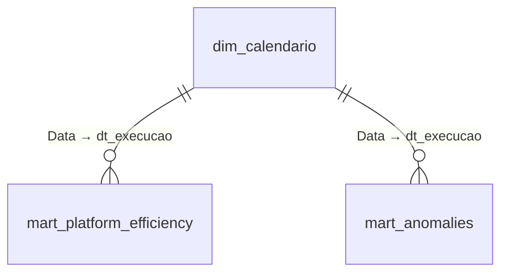

# 📊 Dashboard — FoodCost Monitor

Documentação da camada de visualização do pipeline: modelo semântico, medidas DAX, visuais e como reconectar o relatório localmente.

> 🔗 **[Abrir o dashboard ao vivo](https://app.powerbi.com/view?r=eyJrIjoiMWU2N2VkZDktOTg3MC00NTA2LTljYTgtYjUyNWU3OTNiMzZiIiwidCI6IjJiZDE5YWQ4LTcyZTUtNGY2ZC1hZmY1LWRhOTMwMTdmZGYxYiJ9)** — publicado via *Publish to web* do Power BI Service.

**Sobre o link público:** *Publish to web* gera um embed acessível a qualquer pessoa com a URL, sem autenticação. Isso é aceitável aqui porque **100% dos dados do relatório são sintéticos**, gerados por `generate_synthetic_data.py` — não há dado real de nenhuma empresa. Um relatório com dados reais nunca deveria usar esse modo de publicação.

---

## Sumário

- [Prints](#prints)
- [Fonte de dados](#fonte-de-dados)
- [Modelo semântico](#modelo-semântico)
- [KPI cards](#kpi-cards)
- [Visuais](#visuais)
- [Convenção de nomes das medidas](#convenção-de-nomes-das-medidas)
- [Como reconectar localmente](#como-reconectar-localmente)
- [Limitações conhecidas](#limitações-conhecidas)

---

## Prints

### Visão geral (sem filtros)


### Filtro aplicado — domínio `logistics`

O mesmo relatório com o slicer de domínio em `logistics`. Os KPIs recalculam (tendência de custo sobe para 71.4%, custo médio por job cai para $8.0) e o gráfico de eficiência destaca o domínio selecionado, mantendo os demais como referência visual:


---

## Fonte de dados

O relatório consome **apenas a camada Gold** do dbt — nunca a raw ou a staging:

| Item | Valor |
|---|---|
| Conexão | ODBC, DSN `Amazon Athena ODBC` (driver Simba) |
| Catálogo | `AwsDataCatalog` |
| Schema | `cost_monitor_gold` |
| Tabelas | `mart_platform_efficiency`, `mart_anomalies` |
| Modo de armazenamento | **Import** (não DirectQuery) |

O modo *Import* é uma decisão consciente: como o pipeline roda uma vez por dia (`@daily`), não há ganho em consultar o Athena a cada interação — e cada query em DirectQuery seria uma cobrança de dados escaneados. Com Import, o custo de Athena fica limitado a um refresh diário.

## Modelo semântico

Modelo em estrela, com uma dimensão de calendário dedicada:



| Tabela | Papel |
|---|---|
| `dim_calendario` | Dimensão de tempo (`dataCategory: Time`), marcada como tabela de datas. Colunas: `Data` (chave), `Ano`, `Trimestre`, `MesNo`, entre outras |
| `mart_platform_efficiency` | Fato — KPIs diários por domínio (custo, taxa de sucesso, MTD, score de eficiência) |
| `mart_anomalies` | Fato — uma linha por execução anômala detectada |
| `_measures` | Tabela vazia que serve apenas como container das medidas DAX, organizadas em *display folders* por mart de origem |

A `dim_calendario` existe para que as medidas de janela (`Últ. 7/15/30 dias`) possam usar `ALLSELECTED` e `KEEPFILTERS` sobre um eixo de datas contínuo — sem ela, dias sem execução de job quebrariam o eixo dos gráficos de tendência.

## KPI cards

Os quatro cards do topo, e a medida por trás de cada um:

| Card | Medida | Definição |
|---|---|---|
| **Tendência custo** | `Pc. Tendência Custo Card` | `FORMAT([Pc. Tendência Custo %], "0.0%")` — variação percentual do custo vs. dia anterior |
| **Taxa sucesso** | `Pc. Taxa Sucesso %` | `DIVIDE([Nr. Jobs com Sucesso], [Nr. Total Jobs])` |
| **Custo médio Job** | `Vl. Médio por Jobs` | `SUM(mart_platform_efficiency[vl_medio_por_job])` |
| **Jobs críticos** | `Nr. Jobs Criticos` | `CALCULATE(COUNT(mart_anomalies[id_job]), mart_anomalies[nm_severidade] = "critical")` |

`Pc. Tendência Custo %` reaproveita a coluna `vl_custo_dia_anterior`, já calculada via `LAG()` no `mart_platform_efficiency` — o DAX não recalcula o offset de data, apenas divide:

```dax
Pc. Tendência Custo % =
DIVIDE(
    ([Vl. Total Custo USD] - [Vl. Custo dia Anterior]),
    [Vl. Custo dia Anterior]
)
```

## Visuais

Página única (`Page 1`), com 12 visuais:

| Visual | Tipo | Campos / medidas | Mart |
|---|---|---|---|
| Filtros: Dia, Domínio, Job | 3 slicers | `dim_calendario[Data]`, `nm_dominio`, `nm_job` | ambos |
| Tendência de custo vs. benchmark (15 dias) | Line chart, 2 séries | `Vl. Total Custo USD (Últ. 15 dias)` e `Vl. Média 7d Eficiência (Últ. 15 dias)` | `mart_platform_efficiency` |
| Custo acumulado (MTD) por domínio | Donut | `Vl. Custo MTD` por `nm_dominio` | `mart_platform_efficiency` |
| Anomalias (últimos 7 dias) | Tabela | Data, Domínio, Job, Custo, Severidade | `mart_anomalies` |
| Eficiência por domínio | Bar chart horizontal | `Pc. Score Eficiência` por `nm_dominio` | `mart_platform_efficiency` |

O line chart de tendência tem as medidas de banda de confiança (`Vl. Limite Superior Tendência`, `Vl. Limite Inferior Tendência`, `Vl. Amplitude Banda`) já construídas no modelo — a banda ±2σ ainda não está renderizada no visual, mas as medidas estão prontas para plugá-la.

### Medidas de janela temporal

Todas seguem o mesmo padrão: ancoram na última data com dado (não em `TODAY()`), para que o relatório continue legível mesmo se o pipeline ficar dias sem rodar:

```dax
Vl. Total Custo USD (Últ. 15 dias) =
VAR vDtFiltro =
    CALCULATE(
        MAX(mart_platform_efficiency[dt_execucao]),
        ALLSELECTED(dim_calendario[Data])
    )
RETURN
    CALCULATE(
        [Vl. Total Custo USD],
        KEEPFILTERS(dim_calendario[Data] >= vDtFiltro - 15)
    )
```

Existem variantes para 7, 15 e 30 dias, além de `Vl. Média 7d Eficiência (Últ. 15 dias)` e `Vl. Desvio 7d Eficiência (Últ. 15 dias)`.

### Medida de contexto

`Ds. Domínio mais Caro` retorna o nome do domínio com maior custo na última data disponível, usando `TOPN` sobre `ALLSELECTED(nm_dominio)` — assim o resultado não muda quando o usuário filtra um domínio no slicer.

## Convenção de nomes das medidas

As medidas seguem prefixos por tipo de dado, espelhando a convenção usada nas colunas dos models dbt (ver [README — Modelo de dados](../README.md#-modelo-de-dados)):

| Prefixo | Significa | Exemplo |
|---|---|---|
| `Vl.` | Valor monetário | `Vl. Total Custo USD` |
| `Nr.` | Contagem ou número absoluto | `Nr. Total Jobs` |
| `Pc.` | Percentual | `Pc. Taxa Sucesso %` |
| `Ds.` | Texto / descrição | `Ds. Domínio mais Caro` |

Cada medida fica em um *display folder* com o nome do mart de origem (`mart_platform_efficiency` ou `mart_anomalies`), para que a lista de campos no Power BI espelhe a modelagem do dbt.

## Como reconectar localmente

O `.pbip` no repositório guarda a definição do relatório e do modelo, mas não os dados nem a credencial da conexão. Para abrir e atualizar:

1. Instale o [driver ODBC Simba para Athena](https://docs.aws.amazon.com/athena/latest/ug/connect-with-odbc.html).
2. Crie um **DSN de sistema** com o nome exato `Amazon Athena ODBC` (o nome está gravado na query M — um DSN com outro nome exige editar a fonte no Power Query). Configure nele: região AWS, `AwsDataCatalog` como catálogo, e o *S3 staging directory* — o mesmo valor de `DBT_STAGING_DIR` no seu `.env`.
3. Abra `dashboard/food-delivery-cost-dashboard.pbip` no Power BI Desktop.
4. **Atualizar** — o modelo importa `cost_monitor_gold.mart_platform_efficiency` e `cost_monitor_gold.mart_anomalies`.

> O pipeline precisa ter rodado ao menos uma vez (`dbt run`) para que o schema `cost_monitor_gold` exista no Glue.
